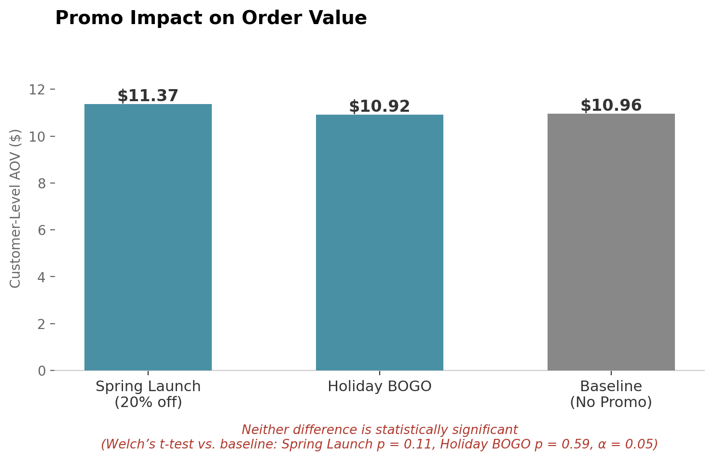
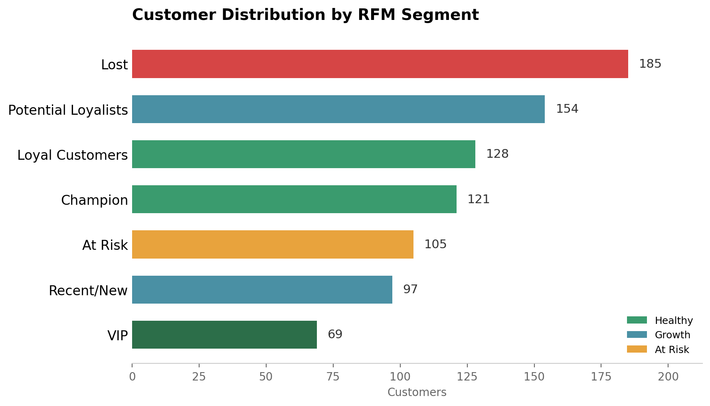
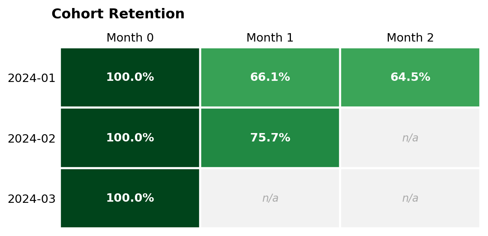

# Retail Growth Analytics: Mean Mug Coffee

*End-to-end retail analytics pipeline — from raw transactions to a production BI dashboard.*

## Key Finding

**Seasonal buyers aren't one-off holiday shoppers — they're a high-value segment hiding in plain sight.**

Customers who buy seasonal products average 3.44 lifetime orders and $38.38 lifetime spend, versus 1.31 orders and $9.79 for baseline buyers — ordering **2.6x more frequently** and spending **~4x more** over their lifetime. That's a retention and targeting opportunity, not a seasonal footnote.

A second finding changed how campaign spend should actually be evaluated — see Business Recommendations below.

## What This Project Does

Mean Mug Coffee is a sample retail business — a 3-location coffee chain with 859 customers and 2,769 transactions — built to run a full analytics pipeline end to end, not a single-tool skill demo. The pipeline takes raw transactional data through deliberate data corruption (nulls, duplicate transactions, orphaned foreign keys, inconsistent formats), then dbt-based cleaning and modeling, then Python-based statistical and segmentation analysis, into a BigQuery warehouse feeding a live Power BI dashboard.

Full technical detail — pipeline architecture, dbt testing, modeling decisions — lives in the [technical appendix](./docs/technical_appendix.md).

## Business Recommendations

**Caught a false signal before it could misdirect spend.** One campaign appeared to raise order value — but the pattern didn't hold up once repeat customers were properly accounted for, and a deeper check found no real effect. Scaling that campaign now would mean spending more against a result that isn't actually there. Full statistical methodology is in the [technical appendix](./docs/technical_appendix.md).



- **Target seasonal buyers as a retention segment** — the 2.6x order frequency and ~4x lifetime spend gap from the Key Finding above represents real revenue at stake, not a one-time holiday bump.
- **RFM segmentation** identifies 7 customer segments as a more actionable targeting base than blanket campaigns:



- **Cohort retention**, tracked by acquisition month:



*(Dashboard: "Mean Mug Growth Analytics | Customer Command Center" — Dynamic LTV $113.91, AOV $11.15, 859 total customers, built in Power BI on the same BigQuery marts.)*

## Technical Deep-Dive →

Full pipeline architecture, dbt modeling decisions, testing strategy, and statistical methodology: see [`docs/technical_appendix.md`](./docs/technical_appendix.md).

**Stack:** dbt, DuckDB → BigQuery, Python (pandas, scipy), Power BI, Git/GitHub.

## Repo Structure

```
raw_data/               clean synthetic source CSVs
chaos_scripts/          chaos_injector.py — seeded corruption injection
dirty_data/             corrupted output + chaos_manifest.md
mean_mug_analytics/     dbt project — staging → intermediate → marts, 25+ tests
python_analytics/       notebooks (cohort retention, LTV, RFM, campaign lift)
                         + significance_testing.py + db_connections/
dashboards/              Power BI (.pbix)
```
